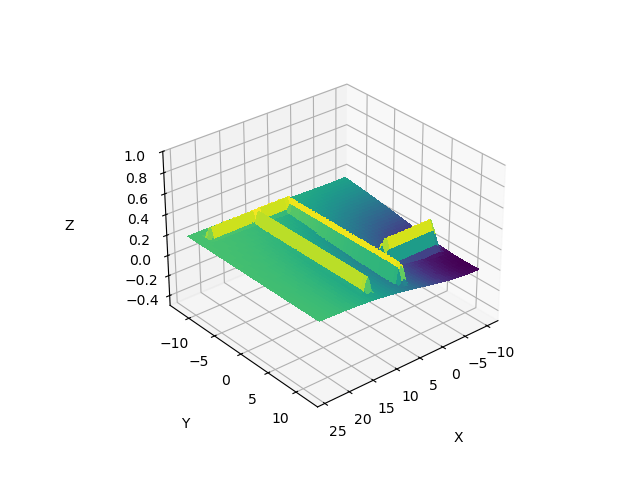

# Offboard Obstacle Avoidance

## Overview
This repo contains a containerized environment for autonomous systems development based on **ROS2**, **PX4 Autopilot**, and **Gazebo**, with an example offboard controller node for obstacle avoidance.
Opening the repo with VS Code is recommended, then `F1 > Dev Containers: reopen in container`. This will 
1. build the image defined in `.devcontainer/Dockerfile`;
2. run `.devcontainer/post_create.sh`;
3. launch the container.

The launch configuration will bind the host directory `./workspaces/` to the directory `/workspaces/` in the container, where the `post_create.sh` script downloaded the `PX4-Autopilot/` development repo.

To test that everything went well, open a new terminal and type

```
# cd /workspace/PX4-Autopilot/
# make px4_sitl gz_x500
```

You should see a new Gazebo window open up, with a `x500` drone in it. In the terminal, the `px4>` prompt should be ready, where the command `commander takeoff` should make the drone take off and hover.

## Obstacle avoidance example

In `workspaces/offboard_ws/` is an example of offboard controller ROS2 node called `vff_controller`. It implements a simple obstacle avoidance algorithm of the artificial potential field kind. The target and obstacles have an associated potential (see picture). The target potential is sloping down toward the target, while the obstacles potentials are sloping away from them. The agent follows the gradient of the total field. The video shows the algorithm in action.




### How to build `vff_controller`
```
# cd /workspace/offboard_ws
# source /opt/ros/humble/setup.bash
# colcon build
```
If you did not yet, build PX4 Autopilot too:
```
# cd /workspace/PX4-Autopilot
# make px4_sitl
```

### How to run `vff_controller`
To run `vff_controller` we need a Gazebo simulation with a PX4 controlled drone

```
# cd /workspace/PX4-Autopilot
# PX4_GZ_WORLD=walls make px4_sitl gz_x500
```
and, in a new terminal, a DDS agent
```
# MicroXRCEAgent udp4 -p 8888
```
Finally, in a third terminal, run `vff_controller`:
```
# cd /workspace/offboard_ws
# source /opt/ros/humble/setup.bash
# source install/local_setup.bash
# ros2 run offboard vff_controller
```
You should see the drone take off in Gazebo. You can make the drone move around by publishing waypoints to go to with

```
# ros2 topic pub --once /waypoint geometry_msgs/msg/Point "{x: 10.0, y: 4.0, z: -5.0}"
```

## Quick commands reference

### Start PX4 SITL simulation
```
# PX4_GZ_WORLD=walls make px4_sitl gz_x500
```

### Source ROS2 and vff_controller node
```
# cd offboard_ws && source /opt/ros/humble/setup.bash && install/local_setup.bash
```

### Publish a waypoint
```
# ros2 topic pub --once /waypoint geometry_msgs/msg/Point "{x: 10.0, y: 4.0, z: -5.0}"
```

## Acknowledgements

Special thanks to [@jamesodukoya](https://github.com/jamesodukoya) for this great [blog post](https://dev.to/james-odukoya/building-a-professional-px4-development-environment-with-docker-ros2-and-vs-code-bgo) on PX4 containerization.